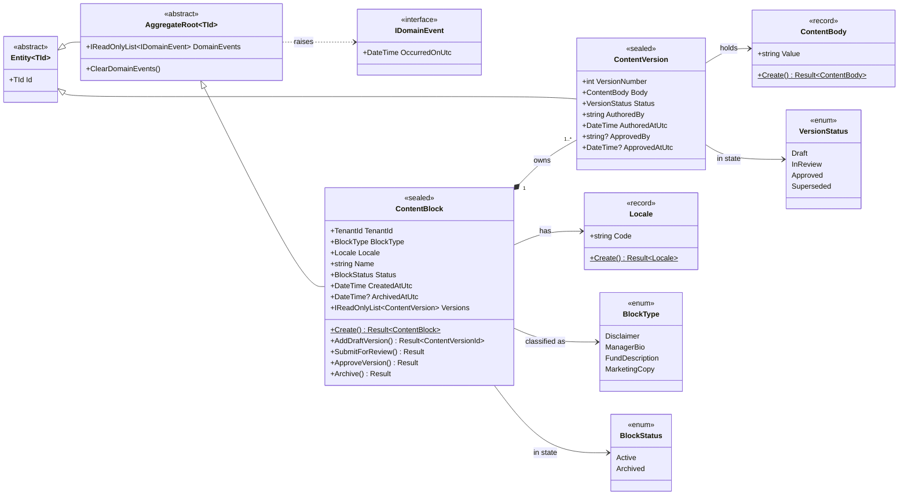
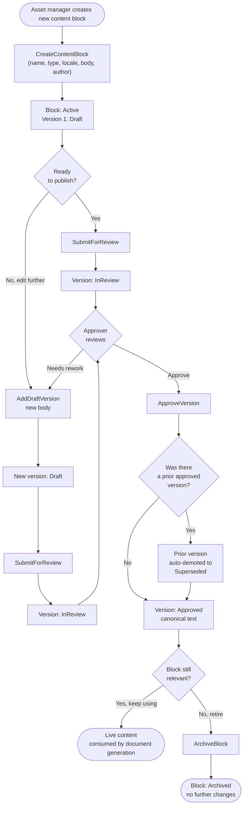
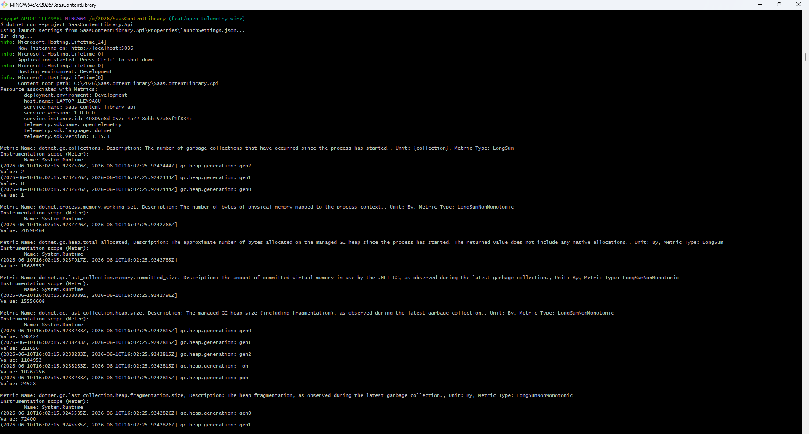

# SaaS Content Library API

A B2B SaaS content library API for asset-management platforms — versioned 
content blocks with a compliance-driven approval workflow, in .NET 10.

## What this demonstrates

- **Clean Architecture** — Domain → Application → Infrastructure → Api with dependency arrows pointing inward only
- **Domain-Driven Design** — aggregate roots, value objects, strongly-typed IDs (`readonly record struct`), domain events, invariants enforced inside the aggregate
- **CQRS with MediatR** — separate write-side (aggregate repository) and read-side (projection-only DTOs via `IContentBlockQueries`)
- **`Result<T>` pattern** — domain failures returned as values, not thrown as exceptions; input-validation failures throw and are mapped centrally
- **EF Core 10 + PostgreSQL** — strongly-typed ID conversions, value-object conversions via static factories, enums stored as strings, unique index on `(ContentBlockId, VersionNumber)` as defense-in-depth
- **OpenTelemetry** — distributed traces across HTTP → MediatR → EF Core → Npgsql → Postgres, exported via OTLP
- **RFC 7807 ProblemDetails** — `Error.Code` patterns route to correct HTTP status (404 / 409 / 400), validation errors carry per-property breakdowns
- **Modern .NET 10 minimal APIs** — `TypedResults<Created<T>, ProblemHttpResult>`, `[AsParameters]` query binding, OpenAPI metadata
- **Scalar API browser** — interactive endpoint explorer at `/scalar/v1`

## Architecture



## Approval workflow



## API endpoints

### Commands (write side)

| Method | URL | Purpose |
|---|---|---|
| `POST` | `/v1/content-blocks` | Create a new content block with version 1 in Draft |
| `POST` | `/v1/content-blocks/{id}/versions` | Add a new draft version |
| `POST` | `/v1/content-blocks/{id}/versions/{versionId}/submit` | Submit a version for review |
| `POST` | `/v1/content-blocks/{id}/versions/{versionId}/approve` | Approve a version (auto-supersedes the prior approved one) |
| `POST` | `/v1/content-blocks/{id}/archive` | Archive the block — no further mutations allowed |

### Queries (read side)

| Method | URL | Purpose |
|---|---|---|
| `GET` | `/v1/content-blocks?tenantId=...&blockType=...` | List blocks for a tenant, optionally filtered by type |
| `GET` | `/v1/content-blocks/{id}` | Get a block with its currently-approved version |
| `GET` | `/v1/content-blocks/{id}/versions` | Get full version history |

## Getting started

### Prerequisites

- **.NET 10 SDK** (10.0.300 or later)
- **Docker Desktop**

### Run locally

```bash
# 1. Start Postgres, pgAdmin, and Jaeger
docker compose up -d

# 2. Restore the local dotnet-ef tool (pinned to a matching EF version)
dotnet tool restore

# 3. Apply database migrations
dotnet ef database update \
  --project SaasContentLibrary.Infrastructure \
  --startup-project SaasContentLibrary.Api

# 4. Run the API
dotnet run --project SaasContentLibrary.Api
```

### Local URLs

| Service | URL | Notes |
|---|---|---|
| API | http://localhost:5036 | The Web API |
| Scalar | http://localhost:5036/scalar/v1 | Interactive endpoint browser |
| OpenAPI | http://localhost:5036/openapi/v1.json | Raw OpenAPI document |
| Health | http://localhost:5036/health | Liveness check |
| pgAdmin | http://localhost:5050 | DB browser (admin@local.test / admin) |
| Jaeger | http://localhost:16686 | Distributed trace viewer |

> **Inside pgAdmin**, register the Postgres server with host **`postgres`** (the Docker service name, not `localhost`) and port **`5432`** (the container's internal port, not the host-mapped `5433`).

### Test the API

Open `SaasContentLibrary.Api/SaasContentLibrary.Api.http` in **VS Code with the REST Client extension** or **Visual Studio / Rider** (built-in). Click "Send request" on each request in order:

1. Create content block → response carries new block ID
2. Paste the ID into `@blockId` at the top
3. Add draft version → paste response into `@versionId`
4. Submit for review → Approve → previous version auto-superseded
5. Get content block → confirm the approved version
6. Archive — no more changes accepted

### Observability — OpenTelemetry

Tracing and metrics are instrumented across the full request pipeline 
(ASP.NET Core → MediatR → EF Core → Npgsql → Postgres) and emitted via 
both a console exporter (verified locally) and OTLP for integration with 
external collectors. The OTLP exporter is wired against Jaeger v2 on 
`http://127.0.0.1:4318` via HttpProtobuf.



> **Note:** Local Jaeger UI visualisation was inconsistent on Windows + 
> Docker Desktop + .NET 10 preview (a known interaction with HTTP/2 
> negotiation to containerised receivers). The OTLP integration itself 
> is correct — traces flow successfully via the console exporter and 
> the OTLP transport is configured per the OpenTelemetry SDK conventions. 
> Production deployments would target a stable OTLP collector (Aspire 
> dashboard, Grafana Tempo, or a managed APM).

## Design decisions

### `Result<T>` instead of exceptions for domain failures

Domain methods return `Result<T>` rather than throwing. Exceptions are reserved for genuinely exceptional cases — a database connection that drops, infrastructure failures the caller can't recover from. Business rule violations like *"can't approve a draft"* or *"this block is archived"* are **expected outcomes of normal user flows**, not errors. With `Result<T>`, every handler explicitly handles both the success and failure cases — the compiler enforces it, the intent is visible at each call site, and `Error.Code` maps cleanly to HTTP 409 / 422 at the API boundary. Input validation is the deliberate exception: invalid input throws `ValidationException` caught by middleware, because well-behaved clients shouldn't produce it.

### Multi-step approval workflow with auto-supersession

Content versions move through `Draft → InReview → Approved → Superseded`. Approving a new version atomically demotes the previously approved one to `Superseded`, enforcing *"at most one Approved version per block at any time"* **inside the aggregate's `ApproveVersion` method** — not via a service-layer check or a database trigger. The aggregate is the boundary where business invariants belong. The Postgres schema also carries a unique index on `(ContentBlockId, VersionNumber)` as defense-in-depth, but the *primary* enforcement is in code. This mirrors how regulated content actually works at asset-management firms.

### Single bounded context, deliberately

A real B2B content platform for asset managers spans many bounded contexts: tenancy, fund data ingestion, content authoring, template rendering, distribution, audit, billing. This project models exactly **one** — content authoring with versioning and an approval workflow. A single context modelled with rigour demonstrates more senior judgment than four sketched superficially. `TenantId` is present as a schema concession (the platform *would* be multi-tenant in production), but tenant resolution, per-tenant isolation, and tenant-aware authorization are explicitly out of scope.

### `TimeProvider` instead of `DateTime.UtcNow`

Every aggregate method takes a `nowUtc` parameter, injected via `TimeProvider` in handlers. The aggregate has no ambient `DateTime.UtcNow` calls. This makes the entire domain trivially testable with a `FakeTimeProvider` — no static mocking, no clock abstractions of our own.

### Strongly-typed IDs as `readonly record struct`

`ContentBlockId`, `ContentVersionId`, and `TenantId` are stack-allocated value-equality wrappers around `Guid`. Type-safety (can't pass a version ID where a block ID is expected) without heap-allocation overhead per ID.

## Status

- ✅ Domain layer — aggregate, entities, value objects, events, errors
- ✅ Application layer — 5 commands + 3 queries, MediatR pipeline behaviors (logging, validation)
- ✅ Infrastructure layer — EF Core 10 + Postgres, repository, unit of work
- ✅ Api layer — minimal API endpoints, ProblemDetails error handling, OpenTelemetry tracing
- ✅ Local dev — `docker compose up` starts Postgres + pgAdmin + Jaeger
- ✅ Domain unit tests
- 🔨 GitHub Actions CI workflow

## Known workarounds

- The Api project explicitly references `Microsoft.CodeAnalysis.Workspaces.Common 5.0.0` to work around an EF Core 10 preview design-time tooling issue. Remove this reference when a later EF Core 10 patch ships its Roslyn dependencies correctly.
- `UseHttpsRedirection()` is conditional on non-Development environment to suppress the *"Failed to determine the https port for redirect"* warning when running on the `http` launch profile.

## Future work

- Domain event dispatching via `SaveChangesInterceptor` + MediatR (currently events are raised and cleared but not consumed — no handlers exist yet)
- Outbox pattern for reliable event delivery once external consumers are added
- Tenant resolution middleware (currently `TenantId` is a passthrough field only)
- Pagination on `ListBlocksByType`

## License

MIT
